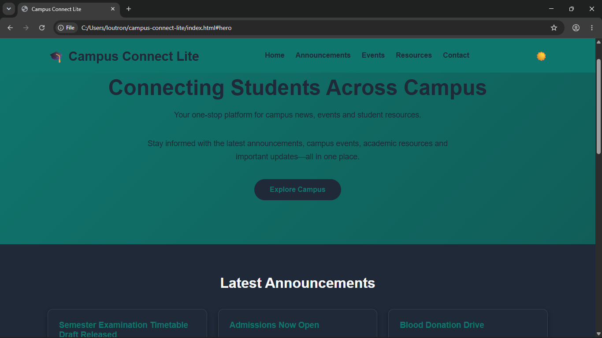

# 🎓 Campus Connect Lite

Campus Connect Lite is a simple web application designed to provide students with quick access to campus information such as announcements, upcoming events, student resources, and contact details.

This project was developed as part of the **INS205** assessment.

---

## Features

- Responsive user interface
- Sticky navigation bar
- Smooth scrolling navigation
- Interactive resource modal
- Light/Dark mode toggle
- Theme persistence using Local Storage
- Mobile-friendly design
- Contact button using mailto

---

## Technologies Used

- HTML5
- CSS3
- JavaScript (Vanilla)

---

## Project Structure

```
Campus-Connect-Lite/
│
├── index.html
├── style.css
├── script.js
├── images/
└── README.md
```

---

## How to Run

1. Clone the repository

```bash
git clone https://github.com/YOUR_USERNAME/Campus-Connect-Lite.git
```

2. Open the project folder.

3. Launch `index.html` in your web browser.

No additional dependencies or installation are required.

---

## Screenshots



---

## Future Improvements

- Student authentication
- Event registration
- Search functionality
- Backend integration
- Database support
- Notice management system

---

## Author

**Louis Terkula Ugande**

Department of Computer Science

University of Jos

Matric Number: UJ/2024/NS/0037

---

## License

This project was created for educational purposes as part of the INS205 coursework.